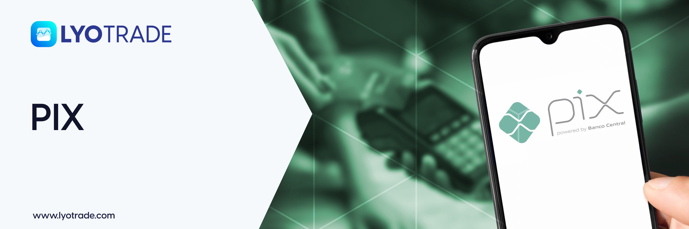

# PIX

<figure><figcaption></figcaption></figure>

## PIX

LYOTRADE's PIX on-ramp allows Brazilian users to easily purchase cryptocurrency with their fiat currency. PIX is a real-time payment technology from the Central Bank of Brazil, which enables users to authenticate payments from their mobile payment application without sharing sensitive card details. Brazilian bank account holders can make payments in BRL without the need for credit/debit card or bank account details, using only their CPF for identification and verification.&#x20;


Transaction limits are a minimum of 110 BRL and a maximum of 5400 BRL, with a maximum of 10 orders per day for BRL to USDT payments.


#### To buy cryptocurrency through PIX on LYOTRADE App, follow these simple steps:

1. Open the LYOTRADE mobile app and select \[Deposit BRL].
2. Enter the BRL or USDT amount and click \[Continue], the system will automatically calculate the other currency value.
3. Verify your CPF number for authentication.
4. Proceed to scan the QR code from your PIX-enabled mobile application for payment. Note that for the first time, a test transaction of 5 BRL will be required for CPF verification, and the payment must be made within 4 minutes and 30 seconds. The payment will be auto-chargeback to the user's bank account once verified.&#x20;

#### To buy cryptocurrency through PIX on LYOTRADE desktop, follow these simple steps:

1. Access PIX through the \[Buy USDT with PIX] link under Services on the menu bar, or through a promotional banner on the homepage after logging in. Alternatively, select Balances, Digital Account, and then select \[Buy USDT].
2. Enter the BRL or USDT amount, and click \[Buy], the system will automatically calculate the other currency value.
3. Verify your CPF number for authentication.
4. Proceed to scan the QR code from your PIX-enabled mobile application for payment. Note that for the first time, a test transaction of 5 BRL will be required for CPF verification, and the payment must be made within 4 minutes and 30 seconds. The payment will be auto-chargeback to the user's bank account once verified.
